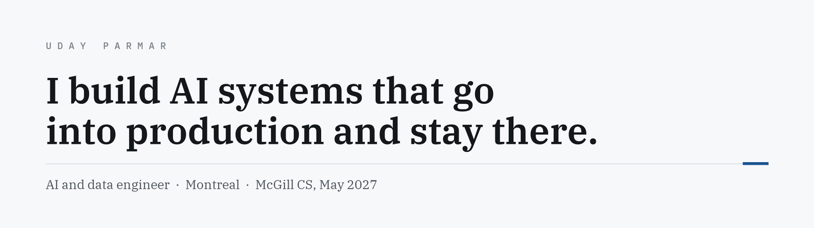
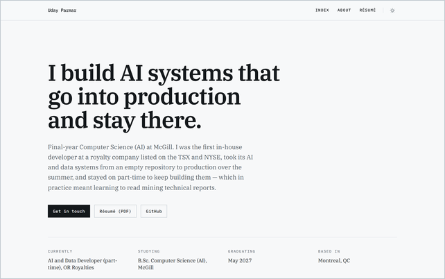
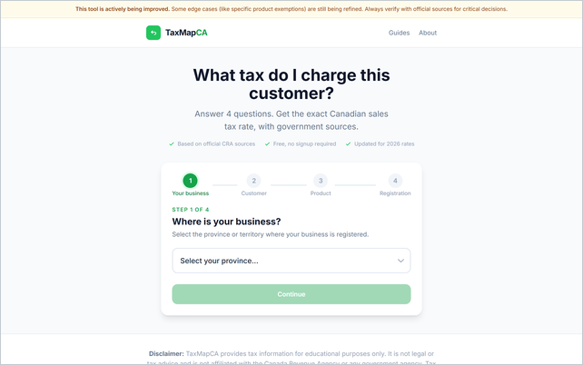
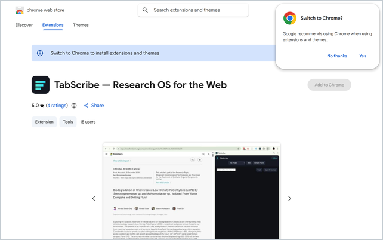
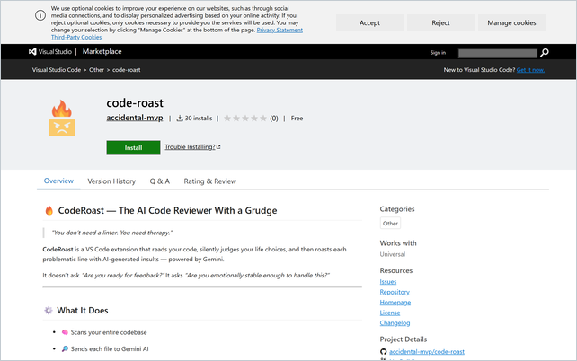

<picture>
  <source media="(prefers-color-scheme: dark)" srcset="assets/banner-dark.png">
  <source media="(prefers-color-scheme: light)" srcset="assets/banner-light.png">
  
</picture>

  
  
  
  
  

Final-year Computer Science (AI) at McGill, graduating **May 2027**. I joined a royalty company
listed on the TSX and NYSE as its first in-house developer and took its AI and data systems from
an empty repository into production over one summer — which in practice meant learning to read
mining technical reports.

I'm most useful somewhere the engineering touches a domain with real rules in it: finance,
compliance, anything where being wrong has consequences and the right answer has to be traceable.

 

## Things you can open right now

<table>
<tr>
<td width="50%" valign="top">

  
<b><a href="https://uday-parmar.vercel.app">Portfolio</a></b> 
Ten projects, each with the problem, the architecture, and what I'd change. Next.js 16, 19 static routes.
</td>
<td width="50%" valign="top">

  
<b><a href="https://www.taxmapca.com">TaxMapCA</a></b> &nbsp; 
Four questions, one exact Canadian sales-tax rate, a government source behind every answer. <b>No model in the decision path</b> — a tax answer that can hallucinate is worse than none.
</td>
</tr>
<tr>
<td width="50%" valign="top">

  
<b><a href="https://github.com/Accidental-MVP/TabScribe">TabScribe</a></b>
&nbsp;
 
Research workspace running entirely on-device through Chrome's Gemini Nano. Summarises, rewrites, translates and cites <b>with the network off</b>.
</td>
<td width="50%" valign="top">

  
<b><a href="https://github.com/Accidental-MVP/code-roast">CodeRoast</a></b> &nbsp; 
AI code review delivered through the editor's own diagnostics pipeline. Linters catch syntax and miss judgment; tools that catch judgment write reports nobody opens.
</td>
</tr>
</table>

The install counts and ratings above are live endpoints — they read from the stores, not from me.

 

## Things worth reading the code of

**[VectralQ](https://github.com/Accidental-MVP/VectralQ)** — enterprise search on Postgres
instead of a vector database. Three retrieval lanes — weighted BM25, pgvector, and a phrase lane
scored separately from bag-of-words — fused with **Reciprocal Rank Fusion** over ranks rather
than scores, then reranked by a cross-encoder. Tenant isolation enforced by Postgres **row-level
security with `FORCE`**: a query that forgets the tenant returns nothing instead of returning
someone else's documents.

Into McGill TechAccel within a month, piloted, shut down on weak demand. The retrieval
worked; the market didn't. Killing it was the right call.

**[ARMM](https://github.com/Accidental-MVP/ARMM)** — a market maker that decides what kind of
market it's in before it decides how to quote. `BAND`/`DRIFT`/`EVENT` classification from rolling
quantiles, EMA persistence and robust volatility, with hysteresis and an event cooldown so it
can't whipsaw itself. Inventory is a steered control variable, slew-rate-limited so the strategy
can't chase its own signal. Solo in 24 hours — **2nd place, National Bank Challenge**.

**[wtf](https://github.com/Accidental-MVP/wtf)** — diagnoses terminal errors against your actual
machine: your Python, your installed packages, your `requirements.txt`, whether your virtualenv
is even active. Pasting a traceback into a chatbot throws all of that away. Runs fully offline
with no API key.

**[DocuMint](https://github.com/Accidental-MVP/DocuMint)** — README generation that survives a
real repository. The chunker and context-aware reader are the project; everything else is
plumbing around deciding what to put in front of the model.

 

## Stack

 

I also built a Chrome extension that files a public GitHub issue every time I get
distracted. It worked, which was the worst part.
